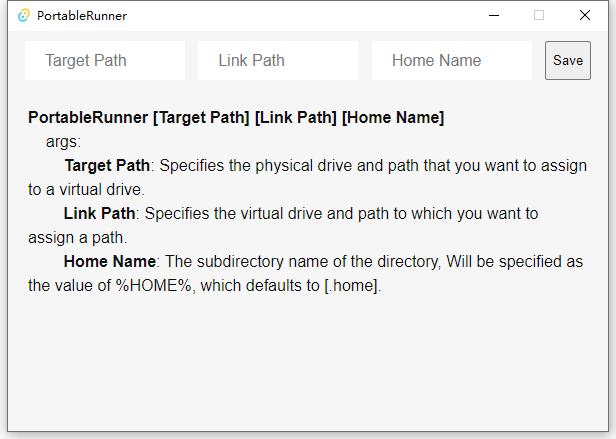
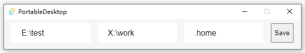
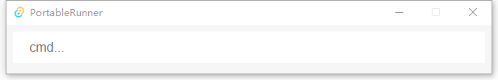

# PortableRunner

**Mount the portable directory as a consistent user directory. Then, based on this user directory, run your program.**   
>***Note, run with administrator privileges.***  

**help**
```cmd
PortableRunner [Target Path] [Link Path] [Home Name]
        args:
                Target Path: Specifies the physical drive and path that you want to assign to a virtual drive.
                Link Path: Specifies the virtual drive and path to which you want to assign a path.
                Home Name: The subdirectory name of the <Link Path> directory, Will be specified as the value of %HOME%, which defaults to [.home].
```

**example**

* No parameters, double click to open  
  

* Input parameters  
  

* Enter to enter the main window  
  

* Enter the command and press Enter to execute it. The command running environment is based on:
```cmd
HOME=X:\work\.home
HOMEDRIVE=X:
HOMEPATH=X:\work\.home
LOCALAPPDATA=X:\work\.home\AppData\Local
PORTABLE_RUNNER_ENV_LINK_PATH=X:\work
PORTABLE_RUNNER_ENV_TARGET_PATH=E:\test
TEMP=X:\work\.home\AppData\Local\Temp
TMP=X:\work\.home\AppData\Local\Temp
USERPROFILE=X:\work\.home
...
```

### .profile  
`%HOME%/[.profile.cmd|.profile.bat]`  
> **One of these two files is automatically executed when the program starts (if the file exists)**  

### .pd.json  
`%HOME%/.pd.json`  
> **Configuration file, currently supports shortcuts configuration**  

**example**
```json
{
    "shortcuts": [
        {
            "key": "reboot",
            "cmd": "shutdown /r /f /t 0"
        },
        {
            "key": "shutdown",
            "cmd": "shutdown /s /f /t 0"
        },
        {
            "key": "open-url",
            "cmd": "msedge",
            "group": "open"
        },
        {
            "key": "open-file",
            "cmd": "explorer",
            "group": "open"
        },
        {
            "key": "open-home",
            "cmd": "explorer %HOME%",
            "group": "open"
        }
    ]
}
```
* entering [open-home], [explorer %HOME%] will be executed
* entering [open-url github.com], [msedge github.com] will be executed

