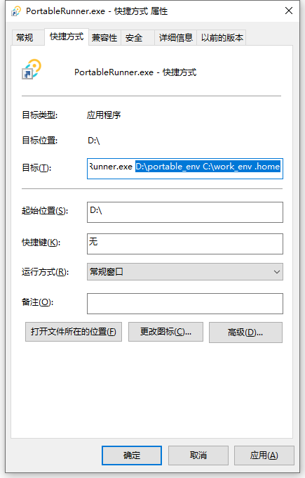
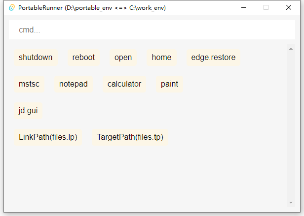
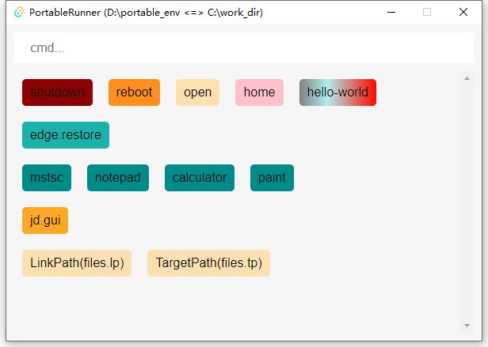

# 启动程序

* 下载程序至D盘：**D:\PortableRunner.exe**
* 下载示例目录至D盘：**D:\portable_env**
* 假定统一的工作目录为：**C:\work_env**

## 默认双击启动

## 固定参数启动（推荐）

* 创建快捷方式
* 然后右击快捷方式，选择属性
* 在目标栏追加参数，空格分隔  

## 启动成功

* 启动成功后，在输入框中输入任意指令回车即可启动（指令需在`PATH`下），且其工作的用户目录为：`C:\work_env\.home`  

## 目录备份
***根据自己的需求去备份&同步 **D:\portable_env** 目录***  
**至此，不管你如何的更换操作系统或电脑设备，只用从云端同步该文件夹至本地，你所有的工作程序都可以轻易的恢复如初，无感继续使用**
